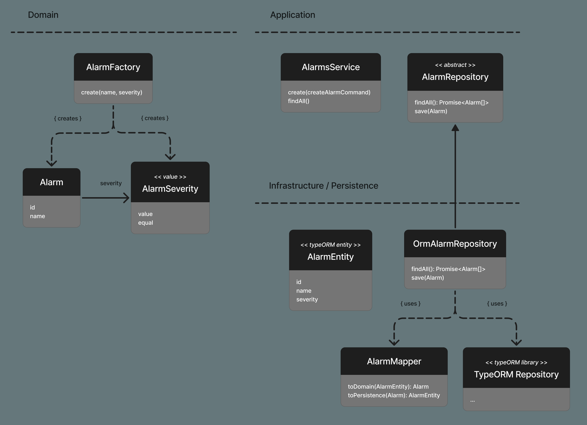

NestJS Fundamentals
===================
https://learn.nestjs.com/p/fundamentals

#### Introduction
Framework around `Node.js`  
includes setup  
and archiecture

scalable  
decoupled

express can be changed to fastify

good for:  
rest api  
microservices  
web sockets  
graphql

#### list all nest commands
```bash
nest --help
```

#### generate controller
```bash
nest generate controller
nest g co
```
and give it a name "coffees"

it will ask about name  
also will add controller to module

place file in sub directory
```bash
nest generate controller modules/abc
```

just test command, don't actually run
```bash
nest generate controller modules/abc --dry-run
```

#### controller get
order of potentially conflicting `@Get` matters

```typescript
@Controller('coffees')
export class CoffeesController {
  @Get()
  findAll() {
    return 'all coffees';
  }

  @Get('flavors')
  findFlavors() {
    return 'all flavors';
  }

  @Get(':id')
  findOne(@Param("id") id: string) {
    return `one coffee by id ${id}`;
  }
}
```

test by using  
GET /coffees  
GET /coffees/flavors  
GET /coffees/123

also all params can be used like
```typescript
findOne(@Param() params) {
```

#### controller post
```typescript
@Post()
create(@Body() body) {
  return body
}
```

body has to be JSON object {...}  
it cannot be just string, like "2" or number

body can be narrowed to one field
```typescript
create(@Body("name") name: string) {
```

#### status codes
by default status for all is 200  
apart from POST which has 201

example of using 410 deprecated
```typescript
@HttpCode(410)
```

#### express response object
allows for full control, but use with care  
you lose support for `@HttpCode`and Nest Interceptors
```typescript
@Get()
findAll(@Res() response) {
  response.status(200).send('all coffees')
}
```

#### update and delete
put: replaces whole object  
patch: modifies only provided parts

```typescript
@Patch(':id')
update(@Param("id") id: string, @Body() body) {
  return `updates ${id} with ${JSON.stringify(body)}`
}
```

```typescript
@Delete(':id')
remove(@Param('id') id: string) {
  return `deletes ${id}`;
}
```

#### query params
```typescript
@Get("/paging")
getPage(@Query() query) {
  return `page ${query.page} with limit ${query.limit}`
}
```

or use Query to get one by one
```typescript
getPage(@Query("page") page: string, @Query("limit") limit: string) {
}
```

#### services
contain business logic  
separate logic from controllers  
often used to interact with data sources

```bash
nest generate service coffees
nest g s
```

each service is provider  
meaning: it can inject dependencies

```typescript
@Injectable()
export class CoffeesService {}
```

nest.js is using type annotations  
to resolve injected dependencies
```typescript
export class CoffeesController {
  constructor(coffeesService: CoffeesService) {
```

by convention it should be private and readonly
```typescript
constructor(private readonly coffeesService: CoffeesService) {
```

Services are injected as singleton  
they are reused in case more than one place injects them.

src/coffees/entities/coffee.entity.ts:1
```typescript
export class Coffee {
  id: number;
  name: string;
  brand: string;
  flavors: string[];
}
```

#### user friendly errors
```typescript
  if (!found) {
    throw new HttpException(`coffeee ${id} not found`, HttpStatus.NOT_FOUND)
```

or simpler
```typescript
throw new NotFoundException(`coffeee ${id} not found`)
```

any typical error, like `throw new Error("foo")` will be handled by Exceptions layer

#### modules
used to organize code  
typical app should consist of several modules

```bash
nest g module coffeees
```

this will generate new module and add it to the closest module  
in relation to current working directory the general command was run  
(this may be app.module.ts)

```typescript
@Module({
  imports: [CoffeesModule],
```

fields inside `@Module` decorator  
`controllers`: api routes this module instantiates  
`providers`: services that need to be instantiated  
`exports`: we list providers that should be available together with this module  
`imports`: list other modules that this module requires

generating new module will also create directory  
if it doesn't exist already

#### data transfer object
```bash
nest g class coffees/dto/create-coffee.dto --no-spec
```

simple objects  
used to define shape of data  
use readonly to force immutability
```typescript
export class CreateCoffeeDto {
  readonly name: string;
  readonly brand: string;
  readonly flavors: string[];
}
```

#### mapped types
to not repeat too much code between dtos  
use nest package mapped types
```bash
npm i @nestjs/mapped-types
```

```typescript
export class UpdateCoffeeDto extends PartialType(CreateCoffeeDto) {}
```

#### validate data using dtos
to enable validations  
`src/main.ts`

```typescript
import { ValidationPipe } from '@nestjs/common';
async function bootstrap() {
  const app = await NestFactory.create(AppModule);
  app.useGlobalPipes(new ValidationPipe())
```

then install packages
```bash
npm i class-validator class-transformer
```

use in dto
```typescript
import { IsString } from 'class-validator';

export class CreateCoffeeDto {
  @IsString()
  readonly name: string;

  @IsString()
  readonly brand: string;

  @IsString({ each: true })
  readonly flavors: string[];
}
```

validate optinal
```typescript
@IsOptional()
```

validate positive number
```typescript
@IsPositive()
```

#### whitelist
strip properties not mentioned in validation  
modify configuration

src/main.ts
```typescript
app.useGlobalPipes(new ValidationPipe({ whitelist: true }))
```

to stop processing and throw error  
instead of stripping an object, use
```typescript
app.useGlobalPipes(new ValidationPipe({ whitelist: true, forbidNonWhitelisted: true }))
```

#### auto transform payloads to dto
turns out that payload by the defualt is in shape of dto  
but below code will actually report false

```typescript
create(@Body() createCoffeeDto: CreateCoffeeDto) {
  console.log("is dto an instance of createCoffeeeDto:", createCoffeeDto instanceof CreateCoffeeDto);
```

validation pipe can transform into dto  
use transform flag

```typescript
app.useGlobalPipes(
  new ValidationPipe({
    whitelist: true,
    forbidNonWhitelisted: true,
    transform: true,
  }),
);
```

transform will also modify types  
it looks at declared type  
here, by default, every path param is string  
but validation pipe can try to convert it

```typescript
@Get(':id')
findOne(@Param('id') id: number) {
```

transform has some efficiency cost  
also when running on production

common pagination dto, parse as numbers

```typescript
import { Type } from "class-transformer";
import { IsOptional, IsPositive } from "class-validator";

export default class PaginationDto {
  @Type(() => Number)
  @IsOptional()
  @IsPositive()
  readonly limit: number;

  @Type(() => Number)
  @IsOptional()
  @IsPositive()
  readonly offset: number;
}
```

instead of explicit transformation with @Type  
we could also make tranformation implicit  
by changing configuration setting  
src/main.ts
```typescript
new ValidationPipe({
  transform: true,
  transformOptions: {
    enableImplicitConversion: true
  }
})
```

### TypeORM and PostgreSQL
#### running postgresql

docker-compose.yml
```yaml
version: "3"

services:
  db:
    image: postgres
    restart: always
    ports:
      - "5432:5432"
    environment:
      POSTGRES_PASSWORD: pass123
```

run docker compose in detached mode  
(in background)
```bash
docker compose up -d
```

run only one service
```bash
docker compose up db -d
```

#### Intro to TypeORM
Nest.js is database agnostic  
it can run on SQL and document databases

Same for TypeORM, which can support several dbs  
MySQL, PostgreSQL, SQLite and even MongoDB

install dependencies
```bash
npm i @nestjs/typeorm typeorm pg
```

import module
```typescript
import { TypeOrmModule } from '@nestjs/typeorm';
@Module({
  imports: [
    CoffeesModule,
    TypeOrmModule.forRoot({
      type: 'postgres',
      host: 'localhost',
      port: 5432,
      username: 'postgres',
      password: 'pass123',
      database: 'postgres',
      autoLoadEntities: true,
      synchronize: true,
    }),
  ],
```

database: name of database used internally in Nest.js  
autoLoadEntities: helps to load modules automatically  
synchronize: ensures that entities are in sync with db

make sure to disable **synchronize** on production  
(it's great on development)

run again and look in logs for  
`[`Nest] 64857  - 01/16/2025, 2:25:15 AM     LOG [InstanceLoader] TypeOrmCoreModule dependencies initialized +23ms
```bash
npm run start:dev
```

#### create entity
defined using `@Entity` decorator  
`synchronize: true` will automatically detect these in code  
and create tables in databases

src/coffees/entities/coffee.entity.ts
```typescript
import { Column, Entity, PrimaryGeneratedColumn } from "typeorm";

@Entity()
export class Coffee {
  @PrimaryGeneratedColumn()
  id: number;

  @Column()
  name: string;

  @Column()
  brand: string;

  @Column('json', { nullable: true })
  flavors: string[];
}
```

by default table will be lowercase class name (here "coffee")  
to change the name, pass it to Entity
```typescript
@Entity('coffees')
```

this sets type to json  
and makes column optional  
columns are not nullable by default  
(they are required by default)

```typescript
@Column('json', { nullable: true })
```

default value
```typescript
@Column({ default: 0 })
recommendations: number;
```

register entity inside module
```typescript
@Module({
  imports: [TypeOrmModule.forFeature([Coffee])],
```

#### using repository
each entity has its own repository  
which is an abstraction over data source

since we have Coffee entitity included in a module  
we can start using repository by injecting in constructor  
and then we can use it in business logic methods

```typescript
@Injectable()
export class CoffeesService {
  constructor(
    @InjectRepository(Coffee)
    private readonly coffeeRepository: Repository<Coffee>,
  ) {}

  findAll() {
    return this.coffeeRepository.find();
  }

  async findOne(id: number) {
    const coffee = await this.coffeeRepository.findOneBy({ id });
    if (!coffee) {
      throw new NotFoundException(`coffeee ${id} not found`);
    }
    return coffee;
  }

  create(createCoffeeDto: any) {
    const coffee = this.coffeeRepository.create(createCoffeeDto);
    return this.coffeeRepository.save(coffee);
  }

  async update(id: number, updateCoffeeeDto: UpdateCoffeeDto) {
    const coffee = await this.coffeeRepository.preload({
      id,
      ...updateCoffeeeDto,
    });
    if (!coffee) {
      throw new NotFoundException(`coffeee ${id} not found`);
    }
    return this.coffeeRepository.save(coffee);
  }

  async remove(id: number) {
    const coffee = await this.findOne(id)
    return this.coffeeRepository.remove(coffee)
  }
}
```

the way update works  
`preload` expects one argument with a id/primary key  
it looks does entity exist in the database  
and retrieves values and modifies them according object  
if entity doesn't exist, undefined is returned

#### typeORM relations

relation types  
one-to-one  
one-to-many  
many-to-many

define owner side
```typescript
@Entity()
export class Coffee {
  @JoinTable()
  @ManyToMany(() => Flavor, flavor => flavor.coffees)
  flavors: string[];
}
```

`@JoinTable()`: place this on side that is owner of relation  
`_ => Flavor`: function that returns related entity  
`flavor => flavor.coffees`: function that returns inverse property

define second side of relation
```typescript
@Entity()
export class Flavor {
  @ManyToMany(() => Coffee, (coffee: Coffee) => coffee.flavors)
  coffees: Coffee[];
}
```

this will result in three tables:  
flavor  
coffee  
coffee_flavors_flavor

relations are **not** eagerly loaded by default  
whe have to specify relations to be resolved  
when calling repository find method

```typescript
return this.coffeeRepository.find({ relations: ['flavors'] });

const coffee = await this.coffeeRepository.findOne({
  where: { id },
  relations: ['flavors'],
});
```

#### insert into relation
to have a cascade insert enabled, add it to configuration

```typescript
// only insert
@ManyToMany(
  () => Flavor,
  (flavor) => flavor.coffees,
  { cascade: ['insert'] }
)

// all cascades
@ManyToMany(
  () => Flavor,
  (flavor) => flavor.coffees,
  { cascade: true }
)
```

#### transactions
database transaction is a unit of work  
performed by database system

there are many ways to have typeORM transactions  
Nest.js has an option to wrap evey request in transaction  
but for now we will use QueryRunner

for a simple case, let's use DataSource  
and inject it into service
```typescript
export class CoffeesService {
  constructor(
    private readonly dataSource: DataSource,
  ) {}

  async recommendCoffee(coffee: Coffee) {
    const queryRunner = this.dataSource.createQueryRunner();
    await queryRunner.connect();
    await queryRunner.startTransaction();
    try {
      coffee.recommendations++;
      const event = new Event()
      event.name = 'recommend_coffee'
      event.type = 'coffee'
      event.payload = { coffeeId: coffee.id }
      await queryRunner.manager.save(event)
      await queryRunner.manager.save(coffee)
      await queryRunner.commitTransaction()
    } catch {
      await queryRunner.rollbackTransaction();
    } finally {
      await queryRunner.release();
    }
  }
```

#### database indexes
typical, one column index
```typescript
@Column()
@Index()
name: string
```

compound indices (several columns)  
are defined on entity class
```typescript
@Index(['name', 'type'])
@Entity()
export class Event {
```

#### migrations
migrations are placed separately from nest.js source  
they life cycle is managed by typeorm

create config in root of project  
ormconfig.js
```javascript
import { DataSource } from "typeorm";

export default new DataSource({
  type: 'postgres',
  host: 'localhost',
  port: 5432,
  username: 'postgres',
  password: 'pass123',
  database: 'postgres',
  entities: ['dist/**/*.entity.js'],
  migrations: ['dist/migrations/*.js'],
})
```

typeorm migrations need to work on compiled files  
which Nest.js will put in dist folder

create migration
```bash
npx typeorm migration:create migrations/CoffeeRefactor
```
npx is utility to use npm packages without installing them

changing column name in entity  
when we do it with synchronize flag,  
typeorm will update local database  
but it will not affect production database

btw.  
it will also erase all data in that column  
only after column is removed, typeorm will create new column  
*(again, migrations can help here, because they will preserve data)*

every migraton should have up and down method  
down is important to undo changes in case there are issues

```javascript
import { MigrationInterface, QueryRunner } from "typeorm";

export class CoffeeRefactor1737146537789 implements MigrationInterface {
    public async up(queryRunner: QueryRunner): Promise<void> {
      queryRunner.query(
        `ALTER TABLE "coffee" RENAME COLUMN "name" TO "title"`
      )
    }

    public async down(queryRunner: QueryRunner): Promise<void> {
      queryRunner.query(
        `ALTER TABLE "coffee" RENAME COLUMN "title" TO "name"`
      )
    }
}
```

before running migrations  
make sure that Nest.JS has build ready
```bash
npm run build
```

run migration
```bash
npx typeorm migration:run -d ormconfig.js
```

with typescript you may need to run this  
to translate into js on the fly
```bash
npx typeorm-ts-node-commonjs migration:run -d ormconfig.js
```

revert migration
```bash
npx typeorm migration:revert -d ormconfig.js
```

detect differences and generate migration file  
it compares @Entity descriptions with state of database  
and creates migration automatically to match entities
```bash
npx typeorm migration:generate -d ormconfig.js migrations/SchemaSync
```

### Dependency Injection
When we ask for dependency in constructor nest handles Dependency Injection.

```javascript
export class CoffeesController {
  constructor(private readonly coffeesService: CoffeesService) {}
}
```

There are three steps required for DI to happen:
- CoffeesService has @Injectable decorator marking it as managed by Nest
- CoffeesService is mentioned as provider in module: `providers: [CoffeesService]`
- We are requesting it in a constructor of the CoffeesController

By default, providers have singleton scope.

Nest instantiates controller  
it looks are there dependencies needed  
Nest performs lookup of CoffeesService token, to get class  
it will create it or get the already created one (since it's a singleton)

It all happens during application bootstrapping  
When there is a graph of dependencies, they are resolved from the bottom

This syntax

```javascript
providers: [CoffeesService]
```

Is a shortcut when token name is same as class  
Here, a `provide` is a token

```javascript
providers: [
  {
    provide: CoffeesService,
    useClass: CoffeesService,
  },
]
```

#### Module Encapsulation
In some sense list of providers is a public api

```bash
nest g mo coffee-rating
nest g s coffee-rating
```

CofeeRating needs CoffeesService to fetch data  
however it belongs to another module.  
To reach it, import that module into new module.

```typescript
// coffee-rating.module.ts
@Module({
  imports: [CoffeesModule],
  providers: [CoffeeRatingService]
})
```

If we request CoffeesService now in a new module,

```typescript
//coffee-rating.service.ts
export class CoffeeRatingService {
  constructor(private readonly coffeesService: CoffeesService) {}
}
```

bootstrapping will end with an error:

```
Please make sure that the argument CoffeesService at index [0]
is available in the CoffeeRatingModule context.
```

This is because all tokens are encapsulated  
and to be accessible from outside, we have to export them.

```typescript
//coffees.module.ts
@Module({
  // ...
  providers: [CoffeesService],
  exports: [CoffeesService]
})
```

#### Custom Providers
Instead of Nest instantiating provider for us,  
we will provide custom provider.

This can be useful:
- to reuse same class in second dependency
- in testing, to provide mocked version
- dynamically resolve dependency on base of some condition

#### Value based Providers
`useValue`

Used to inject constant value.  
When adding external library to nest container.  
Also useful for mocking.

To mock CoffeesService in tests

```typescript
//coffees.module.ts
class MockCoffeesService {}
@Module({
  providers: [{ provide: CoffeesService, useValue: new MockCoffeesService() }],
})
```

#### Non class based Provider Tokens
Use string or symbol as a token

```typescript
//coffees.module.ts
@Module({
  // ...
  providers: [
    { provide: 'COFFEE_BRANDS', useValue: ['buddy brew', 'nescafe'] },
  ],
})
```

On client side, short way of requesting dependency works only  
when the token is defined using a class name.

For non class name tokens, use @Inject

```typescript
//coffees.service.ts
export class CoffeesService {
  constructor(
    @Inject('COFFEE_BRANDS') coffeeBrands: string[]
  ) {}
}
```

consider defining name of string token, COFFEE_BRANDS  
in a separate file and giving that token name a const value

```typescript
// coffees.constants.ts
export const COFFEE_BRANDS = "COFFEE_BRANDS"
```

#### Dynamically select a class, Class Providers
If we have a abstract ConfigService class.  
And we have an environment variable  
that will decide on concrete implementation.

```typescript
// coffees.module.ts

class ConfigService {}
class DevelopmentConfigService {}
class ProductionConfigService {}

@Module({
  // ...
  providers: [
    {
      provide: ConfigService,
      useClass: process.env.NODE_ENV === 'development'
          ? DevelopmentConfigService
          : ProductionConfigService,
    }
  ]
})
```

#### Factory Patterns
Create value in a dynamic way, using factory function.

```typescript
// coffees.module.ts
@Module({
  // ...
  { provide: COFFEE_BRANDS, useFactory: () => ['buddy brew', 'nescafe'] },
})
```

Factory method can inject and use other providers

```typescript
// coffees.module.ts

@Injectable()
export class CoffeeBrandsFactory {
  create() {
    return ['buddy brew', 'nescafe'];
  }
}

@Module({
  // ...
  providers: [
    CoffeeBrandsFactory,
    {
      provide: COFFEE_BRANDS,
      useFactory: (brandsFactory: CoffeeBrandsFactory) => brandsFactory.create(),
      inject: [CoffeeBrandsFactory],
    },
  ],
})
```

#### Async Providers
Sometimes when application bootstrapping needs to be delayed,  
until some of asynchronous tasks are finished.

Like for example, lets not accept requests  
until connection with database is established.

useFactory DI can return Promise and in that case Nest will  
await that promise before instantiating any class dependent on it.

This can solve some race conditions and application startup needs.

```typescript
// coffees.module.ts
import { Connection } from 'typeorm';

@Module({
  // ...
  providers: [
    {
      provide: COFFEE_BRANDS,
      useFactory: async (connection: Connection): Promise<string[]> => {
        const coffeeBrands = await connection.query('SELECT * ...');
        return coffeeBrands;
      },
      inject: [Connection]
    },
  ],
})
```

#### Dynamic Modules
Sometimes we need flexibility when using modules.  
Module may need to behave differently in different circumstances.

Static modules can't have its providers be  
configured by a module that is consuming them.

Dynamic modules need configuration  
before they can be used by a consumer.

```bash
nest g mo database
```

if this module would be static,  
it could look like this

```typescript
import { createConnection } from 'typeorm';

@Module({
  providers: [
    {
      provide: 'CONNECTION',
      useValue: createConnection({
        type: 'postgres',
        host: 'localhost',
        port: 5432,
      }),
    },
  ],
})

export class DatabaseModule {}
```

However what, if we would like to reuse it  
but be able for consumer to change the port?


```typescript
import { DynamicModule, Module } from '@nestjs/common';
import { ConnectionOptions, createConnection } from 'typeorm';

@Module({})
export class DatabaseModule {
  static register(options: ConnectionOptions): DynamicModule {
    return {
      module: DatabaseModule,
      providers: [
        {
          provide: 'CONNECTION',
          useValue: createConnection(options),
        }
      ]
    }
  }
}
```

DynamicModule is very similar to Module,  
however it requires module property to be set.

Consume this dynamic module in other modules

```typescript
// coffee-rating.module.ts
@Module({
  imports: [
    DatabaseModule.register({
      type: 'postgres',
      host: 'localhost',
      password: 'password',
      port: 5432
    })
  ],
  // ...
})
```

#### Providers Scope
You may need some DI providers to be per request.

This can be useful in instance tracking applications  
or multi tenant applications.

Injection scope allows to obtain desired provider  
that has a lifetime you need.

**DEFAULT**  
By default, providers are singleton  
Once application have been boostraped,  
all singletons will be instantiated.

Singleton is recommended for most cases,  
for performance reasons.

```typescript
@Injectable()
```

Is same as

```typescript
@Injectable({ scope: Scope.DEFAULT })
```

**TRANSIENT**  
Transient are not shared between consumers.  
Each consumer will receive separate instance.

```typescript
@Injectable({ scope: Scope.TRANSIENT })
export class CoffeesService { 
  // ...
}
```

For custom providers, the place to define scope  
is in additional property `scope`

```typescript
// coffees.module.ts
@Module({
  // ...
  providers: [
    {
      provide: COFFEE_BRANDS,
      useFactory: () => ['buddy brew', 'nescafe'],
      scope: Scope.TRANSIENT,
    },
  ],
})
```

**REQUEST**  
Provides new instance of requested provider  
exclusively for each incoming request.

Instances are automatically garbage collected  
after the request has completed processing.

This may have impact on your application performance

#### Scope bubbling

This will work as expected,  
creating one instance each time there is a request,  
even if the class that requests this token  
is using default singleton scope

For example we set service to be per request

```typescript
// src/coffees/coffees.service.ts
@Injectable({ scope: Scope.REQUEST })
```

And even though controller is using default,  
it works correctly.

```typescript
// coffees.controller.ts
@Controller('coffees')
export class CoffeesController {
  constructor(private readonly coffeesService: CoffeesService) {}
  // ...
}
```

This is possible, because in Nest, scopes bubble up  
in the injection chain. This means that in above example,  
the CoffeesController implicitly becomes request scope.

#### Request injection
Request scope providers can inject original request object.

This is useful when you need access to request specific information.  
Like headers, cookies, IP addresses, etc.

```typescript
// coffees.controller.ts

import { Request } from 'express';
import { REQUEST } from '@nestjs/core';

@Controller('coffees')
export class CoffeesController {
  constructor(
    private readonly coffeesService: CoffeesService,
    @Inject(REQUEST) private readonly request: Request,
  ) {}
}
```

Perhaps due to bubbling, just by injecting request,  
scope of controller implicitly changes to request.

### Application Configuration
Applications need to run in different environments,  
each with potentially different setting.

development  
staging  
production

One of typical differences is database credentials.

It's a common practice to store these configurations  
as a part of environemnt in a node process global env variable.

Nest.js helps to automate this, with a Config Package.

```bash
npm i @nestjs/config
```

Calling forRoot will parse `.env` from main project location.  
And it will merge these with values in node process.env.  
Storing result in global object that we can access anywhere  
using ConfigService class.

```typescript
// app.module.ts
import { ConfigModule } from '@nestjs/config';
@Module({
  imports: [
    ConfigModule.forRoot(),
  ]
})
```

#### .env files
Common way to hold key value pairs of configuration data.  
Like: secret keys, database options.

```
// .env
DATABASE_USER=postgres
DATABASE_PASSWORD=pass123
DATABASE_NAME=postgres
DATABASE_PORT=5432
DATABASE_HOST=localhost
```

If they contain real secrets, then never track them by git.  
So add it them to gitignore file:

```
// .gitignore
*.env
```

Then start to use these settings.  
All values in process.env are strings by default.

```typescript
// app.module.ts
@Module({
  imports: [
    TypeOrmModule.forRoot({
      type: 'postgres',
      host: process.env.DATABASE_HOST,
      port: +process.env.DATABASE_PORT,
      username: process.env.DATABASE_USER,
      password: process.env.DATABASE_PASSWORD,
      database: process.env.DATABASE_NAME,
      autoLoadEntities: true,
      synchronize: true,
    }),
  // ...
  ],
})
```

#### Custom env file paths
By default .env files are expected to be in the root of app.  
It's possible to change filename, like this.

```typescript
// app.module.ts
ConfigModule.forRoot({
  envFilePath: '.environment'
}),
```

And also it's possible to specify multiple paths.  
Config will be a merge of variables in array of files.  
If the same variable will be found in multiple files,  
the first occurence will be used.

There is also an option, that you will not use .env files.  
Becuase config options will be provided by Heroku  
or something like it.

In that case, there is option to disable env files:

```typescript
// app.module.ts
ConfigModule.forRoot({
  ignoreEnvFile: true
}),
```

#### Config schema validation
Some config variables may be essential.  
it makes sense to throw error on bootstrap,  
in case some of them are missing.

To validate, we will use joi
```bash
npm i @hapi/joi
npm i --save-dev @types/hapi__joi
```

Validate configuration schema

```typescript
// app.module.ts
import * as Joi from '@hapi/joi';

@Module({
  imports: [
    ConfigModule.forRoot({
      validationSchema: Joi.object({
        DATABASE_HOST: Joi.required(),
        DATABASE_PORT: Joi.number().default(5432),
      })
    }),
    // ...
  ],
})
```

To test it, change .env file.  
However Nest doesn't listen for changes in .env files.  
So server has to be restarted manually.

#### Using the Config Service
Config Service is a part of Config Module.  
It provides convinient `get` method to access config variables.

To import it into app, we use `forRoot` in app module.

```typescript
// app.module.ts
import { ConfigModule } from '@nestjs/config';
@Module({
  imports: [
    ConfigModule.forRoot(),
  ]
})
```

But we do use `forRoot` only once.  
To import in other places, just add import like this:

```typescript
// coffees.module.ts
@Module({
  imports: [TypeOrmModule.forFeature([Coffee, Flavor, Event]), ConfigModule],
})
```

Then, to use it call get and provide expected type.  
(string is default and can be ommited)

However that type is just information to compiler.  
Even if we specify number, it will be in runtime a string.  
As every enviroment variable is a string.  
And Nest.js will not convert these.

```typescript
// coffees.service.ts
export class CoffeesService {
  constructor(private readonly configService: ConfigService) {
    const databaseHost = this.configService.get<string>('DATABASE_HOST')
    console.log(databaseHost);
  }
}
```

ConfigService get has also second argument: default value.

```typescript
const databaseHost = this.configService.get<string>('DATABASE_HOST', 'localhost')
```

#### Custom configuration files
For more complex applications we may want  
configuration to return nested objects.

This way we could group settings by domain.  
Like to group all the database related settings.

we will create a factory function  
that will return a configuration object

```typescript
// app.config.ts
export default () => ({
  environment: process.env.NODE_ENV || 'development',
  database: {
    host: process.env.DATABASE_HOST,
    port: parseInt(process.env.DATABASE_PORT, 10) || 5432,
  }
});
```

to use this config factory,  
point to it inside module

```typescript
@Module({
  imports: [
    ConfigModule.forRoot({
      load: [appConfig],
      // ...
    })
  ]
})
```

Access this configuration factory using ConfigService.  
Get function allows to traverse nested configuration.

```typescript
const databaseHost = this.configService.get('database.host', 'localhost')
```

Problems with custom configuration factory above are:
- there is no type checking
- it's easy to do make typo in traverse path string

#### Configuration Namespaces and Partial Registration
Our project can grow so much,  
that we may need multiple config files  
one in each module.

Create configuration inside coffees folder

```typescript
// /coffees/config/coffees.config.ts
import { registerAs } from "@nestjs/config";

export default registerAs('coffees', () => ({
  foo: 'bar',
}))
```

`registerAs` lets us register  
a namespaced configuration object  
under the key passed as argument

To use it, add it to the module using `forFeature`.  
This way of importing is called partial registration.

So far we processed configuration files in root module  
using `forRoot` method. As your application grows you may  
end with several feature specific configuration files  
located in multiple directories.

```typescript
// coffees.module.ts
@Module({
  imports: [
    TypeOrmModule.forFeature([Coffee, Flavor, Event]),
    ConfigModule.forFeature(coffeesConfig)
  ],
  // ...
})
```

To access config variable use ConfigService.get  
passing partial registration key

```typescript
const coffeesConfig = this.configService.get('coffees')
```

which will return object

```typescript
{ foo: 'bar' }
```

While it's also possible to traverse here,  
note that this is error phone  
and would be more difficult to test  
as we would need to mock whole get method.

```typescript
this.configService.get('coffees.foo')
```

The best practice is to inject whole configuration object.  
For that we use exported KEY property of namespaced config.  
And built in ConfigType will infer config type.  
This will provide strong typing benefits.

```typescript
// coffees.service.ts
import { ConfigType } from '@nestjs/config';
import coffeesConfig from './config/coffees.config';

export class CoffeesService {
  constructor(
    @Inject(coffeesConfig.KEY)
    private readonly coffeesConfiguration: ConfigType<typeof coffeesConfig>,
  ) {
    console.log(this.coffeesConfiguration);
  }
}
```

#### Asynchronously Configure Dynamic Modules

TypeOrm is a good example of module,  
that is configured by static method

```typescript
// app.module.ts
@Module({
  imports: [
    ConfigModule.forRoot({
      load: [appConfig],
    }),
    TypeOrmModule.forRoot({
      type: 'postgres',
      host: process.env.DATABASE_HOST,
    })
  ]
})
```

However, if we would reverse order  
and first import TypeOrm, then module would fail.

Because our process environment variables are loaded  
after the TypeOrmModule is configured.

For modules import order to not be important,  
we can use async methods `forRootAsync`, `forFeatureAsync`  
which are added to most Nest.js ecosystem modules


```typescript
@Module({
  imports: [
    TypeOrmModule.forRootAsync({
      useFactory: () => ({
        type: 'postgres',
        host: process.env.DATABASE_HOST,
        // ...
      })
    }),
  ]
})
```

In above example, `useFactory` is like any other async provider  
(from DI lessons) it can be async and can inject dependencies.  
So we could even directly inject ConfigModule into that factory.

This works now, because async configuration will resolve  
after every module in DI has been resolved.


From the Leet Code
==================

#### >> and ~~ limitation
like all bitwise operators, they will convert to32 bit int  
so it cannot be used for numbers higher than:
```
2**32 = 4294967296 = 4.2e9
```

### >> operator
Division by two, rounded down
```javascript
5 >> 1 // 2
```

### ~~ operator
#### Convert string to number
```javascript
~~"412.7" // 412
~~"4"     // 4
~~"-4"    // -4
```

#### Floor of decimal
```javascript
console.log(~~4.7);  // Output: 4
console.log(~~-4.7); // Output: -4
```

#### Convert null or undefined to 0
```javascript
~~null      // 0
~~undefined // 0
~~{}.foo    // 0
```

Works by applying the bitwise NOT (~) operator twice. Since bitwise operators  
only work on integers, JavaScript internally converts the number to a 32-bit  
signed integer.

#### Why to use it
It is more performant than Math.floor(), Math.trunc(), or parseInt().

### Arrays in Javascript
https://developer.mozilla.org/en-US/docs/Web/JavaScript/Reference/Global_Objects/Array  
Arrays are stored as a object with indexes as properties  
these indexes are strings

#### toString() cooercion
when calling element arr[index]  
engine will do implicit index.toString() convertion  
`arr[2]` is same as `arr["2"]`

```javascript
arr = [23, 13, 456] // (3) [23, 13, 456]
arr["2"]            // 456
arr[2]              // 456
arr["05"] = "foo"
arr                 // (3) [23, 13, 456, 05: 'foo']
```

#### Typed arrays
https://developer.mozilla.org/en-US/docs/Web/JavaScript/Reference/Global_Objects/TypedArray

faster and better on memory  
but more restictive

fixed size: length set on creation and cannot change  
typing: all elements have to be same type  
fast: use contignous memory making access and iteration faster  
no push: no array push(), splice() etc, because they have fixed size

```javascript
let arr = new Int32Array(10);
arr[0] = 42;
arr[1] = 100;
console.log(arr[0]); // 42
console.log(arr.length); // 10
```

https://developer.mozilla.org/en-US/docs/Web/JavaScript/Guide/Typed_arrays

| Type              | Aprox range | bytes |
|-------------------|-------------|-------|
| Uint8Array        | 0 to 255    | 1     |
| Uint8ClampedArray | 0 to 255    | 1     |
| Uint16Array       | 0 to 6e4    | 2     |
| Uint32Array       | 0 to 4e9    | 4     |
| BigUint64Array    | 0 to 1e19   | 8     |

| Type          | Aprox range   | bytes |
|---------------|---------------|-------|
| Int8Array     | -128 to 127   | 1     |
| Int16Array    | -3e4 to 3e4   | 2     |
| Int32Array    | -2e9 to 2e9   | 4     |
| BigInt64Array | -9e18 to 9e18 | 8     |

| Type         | Aprox range     | bytes |
|--------------|-----------------|-------|
| Float16Array | -6e4 to 6e4     | 2     |
| Float32Array | -3e38 to 3e38   | 4     |
| Float64Array | -1e308 to 1e308 | 8     |

to check precise size calculate 2 to power of bites
```
2**8 = 256
2**16 = 65536
2**32 = 4294967296 = 4.2e9
2**64 = 18446744073709552000 = 1.8e19
```

### JS binary operators
| Operator | Name                  | Example  | Binary Calculation | Result                            |
|----------|-----------------------|----------|--------------------|-----------------------------------|
| &        | AND                   | 5 & 1    | 0101 & 0001        | 0001 (1)                          |
| \|       | OR                    | 5 \|  1  | 0101 \| 0001       | 0101 (5)                          |
| ^        | XOR                   | 5 ^ 1    | 0101 ^ 0001        | 0100 (4)                          |
| ~        | NOT                   | ~5       | ~00000101          | 11111010 (-6 in two's complement) |
| <<       | Left Shift            | 5 << 1   | 0101 << 1          | 1010 (10)                         |
| >>       | Right Shift           | 5 >> 1   | 0101 >> 1          | 0010 (2)                          |
| >>>      | Zero-fill Right Shift | -5 >>> 1 | `11111011 >>> 1`   | Fills with 0 instead of sign bit  |

All of them use 32 bit uint  
So if number is higher, it will be limited


Defensive Semicolon
===================
As seen in zustand sourcecode:

src/middleware/persist.ts:313
```typescript
;(api as StoreApi<S> & StorePersist<S, S>).persist = {
```

This is used to prevent problems when lines would be joined into one line  
during minification. It seems to be especially common on lines which start with  
parenthesis.

```typescript
a + b
(c as Api).persist()

// after lines join becomes b() invocation
a + b(c as Api).persist()
```


NestJS Architecture and Advanced patterns
=========================================
https://learn.nestjs.com/p/architecture-and-advanced-patterns

#### start new app
```bash
nest new nest-advanced
nest g res alarms
```

#### layer (n-tier) architecture
each layer has specific role  
communication between layers is well defined

presentation: user interactions  
application: manages flow  
domain: business rules  
data access: persistence

nest has three layer architecture by default  
controllers: user requests handling  
services: business logic  
data access: persistence

### Hexagonal Architecture
also known as "ports and adapters"  
separates core business logic from external factors  
(databases, user interfaces, frameworks)

#### ports
interfaces that represent entry-points into application  
define contract for interaction of domain with external world

#### adapters
implement these port interfaces  
serve as bridge between domain and external systems  
translate from language of domain to external systems

adapters usually delegate a lot

#### dependency inversion
high level modules should not depend on low level  
central domain should not depend external systems  
*(instead both shuold depend on abstractions know as ports)*

#### flow
in traditional architecture flow is:  
controllers -> services -> persistence

in hexagonal services are in center  
controllers -> services <- persistence

### Hexagonal In Practice


create folders

#### application:
application layer, manages the flow  
it will comunicate with database through ports

#### domain:
domain model, value objects, domain events

#### infrastructure: 
message brokers, data access components

#### presenters:
controllers, gateways, user facing elements  
sometimes called user interface

#### reorganize files
after `nest g res`  
into application folder: move alarms service and module  
into presenters/http: controller and dto  
*(all of these move with tests)*  
also remove entities folder

#### add domain files:
domain/alarm.ts  
domain/value-obejects/alarm-severity.ts

```typescript
export class AlarmSeverity {
  constructor(readonly value: 'critical' | 'high' | 'medium' | 'low') {}

  equals(severity: AlarmSeverity) {
    return this.value === severity.value;
  }
}
```

#### value objects
name originates from Domain Driven Design  
immutable object that describes fragment of domain with no identity

two value objects are equal when they have same value  
they don't have to be same object

#### create factory
domain/factories/alarm.factory.ts

```typescript
@Injectable()
export class AlarmFactory  {
  create(name: string, severity: string) {
    const alarmId = randomUUID();
    const alarmSeverity = new AlarmSeverity(severity as AlarmSeverity['value'])
    return new Alarm(alarmId, name, alarmSeverity)
  }
}
```

#### what about dtos?
since dtos belong now to the presentation layer  
they cannot be used by controllers, which are domain layer

we could move them to application layer  
but they represent data that is sent over the network  
so its definitely more a user facing, user interface element  
and they also contain validation rules

we could create new class, Payload or Command  
or type arguments in controller as any

application/commands/create-alarm.command.ts
```typescript
export class CreateAlarmCommand {
  constructor(
    public readonly name: string,
    public readonly severity: string
  ) {}
}
```

after this, we need to make sure that controller  
which is in presenters layer, will create that CreateAlarmCommand

```typescript
@Post()
create(@Body() createAlarmDto: CreateAlarmDto) {
  return this.alarmsService.create(
    new CreateAlarmCommand(createAlarmDto.name, createAlarmDto.severity),
  );
}
```

#### ports
define constract of interaction with external world  
adapters implement these contacts and serve as translating bridge

/application/ports/alarm.repository.ts
```typescript
export abstract class AlarmRepository {
  abstract findAll(): Promise<Alarm[]>
  abstract save(alarm: Alarm): Promise<Alarm>
}
```

*It seems like "domain" center of Hexagonal architecture*  
*is realize in project by:*  
*/domain: entities, value objects, factories*  
*/application: services, commands (dtos replacement), ports*

we use abstract class because they can be injected  
(typescript interfaces are wiped out during transpilation)

#### TypeORM persistence adapter
/infrastructure/persistence/orm/entities/alarm.entity
```typescript
@Entity('alarms')
export class AlarmEntity {
  @PrimaryColumn('uuid')
  id: string

  @Column()
  name: string

  @Column()
  severity: string
}
```

/infrastructure/persistence/orm/repositories/alarm.repository.ts
```typescript
export class OrmAlarmRepository implements AlarmRepository {
  constructor(
    @InjectRepository(AlarmEntity)
    private readonly alarmRepository: Repository<AlarmEntity>,
  ) {}

  async findAll(): Promise<Alarm[]> {
    const entities = await this.alarmRepository.find();
    return entities.map((item) => AlarmMapper.toDomain(item));
  }

  async save(alarm: Alarm): Promise<Alarm> {
    const persistenceModel = AlarmMapper.toPersistence(alarm)
    const entity = await this.alarmRepository.save(persistenceModel);
    return AlarmMapper.toDomain(entity)
  }
}
```

/infrastructure/persistence/orm/mappers/alarm.mapper.ts
```typescript
export class AlarmMapper {
  static toDomain(alarmEntity: AlarmEntity) {
    const alarmSeverity = new AlarmSeverity(
      alarmEntity.severity as "critical" | "high" | "medium" | "low",
    );
    const alarmModel = new Alarm(
      alarmEntity.id,
      alarmEntity.name,
      alarmSeverity,
    );
    return alarmModel;
  }

  static toPersistence(alarm: Alarm) {
    const entity = new AlarmEntity();
    entity.id = alarm.id;
    entity.name = alarm.name;
    entity.severity = alarm.serverity.value;
    return entity;
  }
}
```

Create orm persistence module and  
Instruct NestJS to use OrmAlarmRepository whenever AlarmRepository is requested  
This is where we actually bind port to adapter

/infrastructure/persistence/orm/orm-persistence.module.ts
```typescript
@Module({
  imports: [TypeOrmModule.forFeature([AlarmEntity])],
  providers: [
    {
      provide: AlarmRepository,
      useClass: OrmAlarmRepository,
    }
  ],
  exports: [AlarmRepository]
})
export class OrmAlarmPersistenceModule {}
```

#### In memory adapter of AlarmRepository
Create similar `/persistence/in-memory` adapter  
Including all the same files, but using Javascript Map as a store

#### Define general Infrastructure Module
Both OrmAlarmsPersistentModule and InMemoryAlarmPersistenceModule  
export same dependency injection token (token with the same name)  
which is `AlarmRepository`

Below module definition of Infrastructure Model will select one of them  
to be used in rest of Nest application when requested.

/infrastructure/persistence/alarms-infrastructure.module.ts
```typescript
import { Module } from "@nestjs/common";
import { InMemoryAlarmPersistenceModule } from "./in-memory/in-memory-persistence.module";
import { OrmAlarmPersistenceModule } from "./orm/orm-persistence.module";

@Module({})
export class AlarmsInfrastructureModule {
  static use(driver: "orm" | "in-memory") {
    const persistenceModule =
      driver === "orm"
        ? OrmAlarmPersistenceModule
        : InMemoryAlarmPersistenceModule;

    return {
      module: AlarmsInfrastructureModule,
      imports: [persistenceModule],
      exports: [persistenceModule],
    };
  }
}
```

Include InfrastructureModule to be used in domain

#### Use Infrastructure to perform create in Service
/application/alarms.module.ts
```typescript
export class AlarmsModule {
  static withInfrastructure(infrastructureModule: Type | DynamicModule) {
    return {
      module: AlarmsModule,
      imports: [infrastructureModule]
    }
  }
}
```

This line allow users of Alarms Module  
to pass infrastructureModule that they want to use  
*(it's an example of modules composition pattern)*

this allows to decouple application layer from infrastructure

```typescript
imports: [infrastructureModule]
```

Finally, use Repository interface to create  
also inject alarmRepository into AlarmsService

/application/alarms.service.ts
```typescript
@Injectable()
export class AlarmsService {
  constructor(
    private readonly alarmRepository: AlarmRepository,
    private readonly alarmFactory: AlarmFactory
  ) {}

  create(createAlarmDto: CreateAlarmCommand) {
    const alarm = this.alarmFactory.create(
      createAlarmDto.name,
      createAlarmDto.severity,
    )
    return this.alarmRepository.save(alarm)
  }

  findAll() {
    return this.alarmRepository.findAll()
  }
}
```

#### Bootstraping
Create interface that will represent options  
that we can use to bootstrap (setup on start) our application

src/common/interfaces/application-bootstrap-options.interface.ts
```typescript
export interface ApplicationBootstrapOptions {
  driver: 'orm' | 'in-memory';
}
```

then let's generate new module
```bash
nest g mo core
```

Depending on the driver in bootstrap options  
we are going to either import typeorm module  
or not import anything at all.

```typescript
@Module({})
export class CoreModule {
  static forRoot(options: ApplicationBootstrapOptions) {
    const imports =
      options.driver === "orm"
        ? [
            // hardcoded for simplicity
            // but generally should be in environment variables
            TypeOrmModule.forRoot({
              type: "postgres",
              host: "localhost",
              port: 5432,
              password: "pass123",
              username: "postgres",
              autoLoadEntities: true,
              synchronize: true,
            }),
          ]
        : [];

    return {
      module: CoreModule,
      imports,
    };
  }
}
```

Then make main App Module aware of Bootstrap options.

src/app.module.ts
```typescript
@Module({
  imports: [CoreModule],
  controllers: [AppController],
  providers: [AppService],
})
export class AppModule {
  static register(options: ApplicationBootstrapOptions) {
    return {
      module: AppModule,
      imports: [
        CoreModule.forRoot(options),
        AlarmsModule.withInfrastructure(
          AlarmsInfrastructureModule.use(options.driver)
        )
      ]
    }
  }
}
```

Finally select used bootstrap options in main.ts

src/main.ts
```typescript
async function bootstrap() {
  const app = await NestFactory.create(
    AppModule.register({ driver: "in-memory" }),
  );
  await app.listen(process.env.PORT ?? 3000);
}
bootstrap();
```

### Onion Architecture
Similar to Hexagonal in that it:  
- puts domain in the center
- is good at decoupling

In many cases they are almost identical  
although they are presented using different diagrams  
infrastructure -> application -> domain

flow of dependencies goes from infrastructure to domain  
using DI  
outer layers remain dependent on inner layers  
and inner layers are unaware of outer layers

#### confusion with diagram
Onion layer lead to a lot of confusion in Software Developer community  
Because on diagram UI and database are positioned in the same layer (infrastructure)

This lead many to wrong conclusion, that Onion is insecure  
because UI directly interact with Database  
but that's simply not true

Diagram is just a visual representation of architecture  
and it doesn't mean that UI can interact with Database directly  
Layers on Onion diagram are not ment to group components,  
but show direction of dependencies

#### vs Hexagonal
Diagrams and concepts of Hexagonal and Onion are so similar  
that they are generally the same.  
Although there may be applied slightly different in practice.  
Naming conventions and some design decisions are generally the same.

### Domain-Driven Desgin
set of patterns (concepts) and practices  
approach to developing a software project

concentrate on domain model and logic  
Eric Evans: tackling complexity in the heart of software

#### ubiquitous language (wszechobecny)
structure in our code should match that in business domain  
it's about creating a language that connects implementation to business experts

words and phrases from the business domain are directly used in the code base  
and it's about creating model of that domain  
describing all the objects and interactions between them  
using language that is both understood by developers and business experts

#### strategic design process
to achieve DDD,  
to identify core domain and subdomains:  
1. domain storytelling  
2. event storming  
3. context mapping

#### 1. Domain Storytelling
What it is:  
Gather domain experts and team members together.  
Let the experts narrate real-world business processes in plain language.  
Visually record each “story” (e.g., actors, actions, and work artifacts) to uncover domain terminology and workflows.

#### 2. Event Storming
What it is:  
A collaborative workshop where participants use sticky notes to model domain events (e.g., “Ticket Issued,” “Payment Received,” etc.).  
The focus is on key events that change the state of the system.  
By grouping events, commands, and policies, you discover natural groupings and potential bounded contexts.

#### 3. Context Mapping
What it is:  
Identify bounded contexts (subdomains) within your larger domain, each with its own model and language.  
Show how these contexts relate (e.g., “Ticketing Context” depends on “Payment Context”).  
Defines integration points, ownership of data, and which domain is your “core.”

#### Expressing domain model in the code
building blocks:  
entities  
value objects  
aggregates  
factories  
repositories  
services  
domain events

#### Entity
unique objects that have identity  
even when values of entity A and B are same  
entities are not same

they are mutable  
and even if values of entity A change  
it's still the same entity

they have lifecycle

#### Value object
immutable  
don't have unique identifier  
they are equal to each other if they have same attributes

#### Aggregate
cluster of objects treated as a single unit

they ensure that all the objects within aggregate are always  
in consistient and valid state, that invariants are satisfied

Aggregate represents transactional consistiency boundary.  
Changes in the objects within aggreage should be done in single transaction.

#### Repository
Are used to persist and retrieve aggregates.

Repository provides abstraction over the database layer.  
They enable to work with aggregates without worrying about   
underlying database access and storage implementation.

#### Service
Encapsulate domain logic that doesn't belong to  
any particual entity or value object.

Example: sending emails to users when new alarm is created.

Heavy usage of services is often a signal of a problem.  
That the model itself is "anemic".  
Anemic model is antipattern.  
Meaning: domain doesn't contain any logic (any functions that perform)  
and is just a bunch of getters and setters.

#### Factory
Encapsulate creation of complex objects.  
Especially useful if creation of an objects involves:  
- complex validation
- initialization
- coordination  
of many objects

Factories help to keep domain clean and focus on business logic  
While offloading responsibility of object creatiion to dedicated factory classes.

#### Event
Communicate and capture domain specific information about actions  
or domain model changes that have happened in the past.

Events play a crucial role in enabling loose coupling,  
scalability and eventual consistiency in distributed systems.

two types of events:  
domain events  
integration events.


NestJS Docs, websockets
=======================
https://docs.nestjs.com/websockets

Nest abstracts implementation details  
same component can run on Http-based api, WebSockets, Microservices

installation
```bash
npm i @nestjs/websockets @nestjs/platform-socket.io
```

#### Gateways
can be treated as providers  
they can inject through constructor  
and be injected

they are not instantiated  
until referenced in providers of module

@WebSocketGateway  
two WS platforms are supported: `socket.io` and `ws`

| name      | stars | created |
|-----------|-------|---------|
| socket.io | 62k   | 2010    |
| ws        | 22k   | 2011    |

by default same port as http server is used  
to have different or a namespace add argument

```typescript
@WebSocketGateway(80)
@WebSocketGateway(80, { namespace: 'events' })
@WebSocketGateway(81, { transports: ['websocket'] })
```


NestJS Docs Crud
================
https://docs.nestjs.com/

### Install
```bash
npm i -g @nestjs/cli
nest new project-name
```

App is organized in  modules.  
Each defined like this

```typescript
@Module({
  imports: [],
  controllers: [AppController],
  providers: [AppService],
})
```

Symbol `@` is part of TypeScript decorators.  
They are functions applied to classes, functions or vars.  
Often used in dependency injection systems.

#### create app
and exit with code 1 on error
```typescript
const app = await NestFactory.create(AppModule);
```

throw an error instead
```typescript
NestFactory.create(AppModule, { abortOnError: false })
```

#### express
is default, but fastify can be also choosen  
to access underlying platform api, add a type

```typescript
const app = await NestFactory.create<NestExpressApplication>(AppModule);
```

#### start
with babel
```bash
npm run start
```

with swc
```bash
npm run start -- -b swc .
```

to watch changes
```bash
npm run start: dev
```

eslinter and prettier
```bash
npm run lint
npm run format
```

### controller
to generate crud controller with validation
```bash
nest g resource [name]
```

to generate only controller
```bash
nest g controller [note]
```

simple example of controller
```typescript
@Controller('cats')
export class CatsController {
  @Get()
  findAll() {
    return 'This action return all cats';
  }
}
```

@Get decorator before `findAll` method  
tells Nest to create a handler for http requests.  
route will be `/cats`

@Get('breed') would have path `/cats/breed`

two options for manipulating responses:

#### standard (recommended)
JSON serialize result of request handler.  
status always 200, except for POST, which use 201  
to change this, use @HttpCode on handler level
```typescript
import { HttpCode } from @nestjs/common
@HttpCode(204)
```

#### library-specific (Express)
use Express response object  
can be injectd using @Res() in handler

```typescript
findAll(@Res() response) {
  response.status(200).send()
}
```

if use of @Res is detected  
then standard option is disabled  
and you become responsible for managing the response  
and using `res.json()` or `res.send()`  
unless passtrough is used which means standard way is still used

```typescript
@Res({ passtrough: true })
```

#### Request object
```typescript
findAll(@Req() request: Request)
```
consider installing `@types/express`

| decorator               | value                          |
|-------------------------|--------------------------------|
| @Request(), @Req()      | req                            |
| @Response(), @Res()     | res                            |
| @Next()                 | next                           |
| @Session()              | req.session                    |
| @Param(key? :string)    | req.params, req.params[key]    |
| @Body(key?: string)     | req.body, req.body[key]        |
| @Query(key?: string)    | req.query, req.query[key]      |
| @Headers(name?: string) | req.headers, req.headers[name] |
| @Ip()                   | req.ip                         |
| @HostParam()            | req.hosts                      |


Few notes on Express
====================
Express app is organized in series of middleware  
each middleware should either:

- call `next()`: go to next middleware
- call `next(err)`: skip to error handling middleware
- call `res.send()`: terminate with response

Otherwise request may hang indefinitely

#### Post handler

```typescript
@Post()
create() {
  return 'this action adds a cat';
}
```

list of decorators
```typescript
@Get()
@Post()
@Put()
@Delete
@Patch
@Options
@Head
```

this one will handle all of them:
```typescript
@All
```

#### Route wildcards
can use: `*`, `+`, `?` and `()`
```typescript
@Get('ab*cd')
```

#### Response headers
```typescript
@Header('Cache-Control', 'no-store')
```

#### Redirect
```typescript
@Redirect('https://nestjs.com', 301)
```

returned values will override any arguments of @Rediredt  
localhost:3000/cats/docs will be redirected to https://docs.nestjs.com  
localhost:3000/cats/docs?version=5 will be redirected to https://docs.nestjs.com/v5/

```typescript
@Get('docs')
@Redirect('https://docs.nestjs.com', 302)
getDocs(@Query('version') version: string) {
  if (version && version === '5') {
    return { url: 'https://docs.nestjs.com/v5/' };
  }
}
```


Functional Programming with Javascript v2
=========================================
Anjana Vakil  
slides: https://observablehq.com/embed/@anjana/what-is-functional-programming  
excercises: https://functional-first-steps.netlify.app/1-intro/1-overview/

### Pure functions
most important concept in functional programming  
functional programming can be defined as:  
1) immutable data  
2) pure functions which transform that data

pure function is basically a transformation  
from input to output

non-deterministic:  
call the same function several times  
with same arguments  
but get different output/result

Calling a method with mutable array as parameter  
is in theory inpure, because function relies on  
external state of program.

(In theroy while the function is running there is potential  
that some parallel code will modify it in place and  
have impact on result)

(but in practice in javascript while the function is running  
javascript engine cannot run any other place (... service workers perhaps?))

#### isolate inpurities
In real projects  
usually there is small core at center  
(small pure inner shell)  
that is pure and where calculations and algoritm is

and then it is surrounded with code that uses that core  
and has side effects  
which are necessary and totally needed  
to have a meaningfull program that is doing something in the world

#### theoretical inpurity / practical purity
perhaps it would make sense to think about software in two ways  
that some fragments are theoretically impure but in practice they are pure  
(like if we dependent on some external javascript built-in that only in theory may change)  
(or we know we don't have any service workers and we are sending mutable data as argument)

### higher order functions
functions as first class citizens  
we say that language has first-class functions  
if functions can be passed as arguments in calls

higher-order functions:  
take other functions as input/output

examples:  
map, reduce, filter

### recursion
#### tail call optimization
whenyou avoid allocating a new stack frame

### closure
function remembers its lexical scope at the moment its defined

### immutability
#### immutable data structuress
in Javascript this will be from libraries:

under the hood immutable data structres are very smart  
instead of copying whole array element by element  
they will use trees as internal representation of array  
and manipulate parts of these trees  
to reuse original big chunks of orignal immutable data  
and apply only changes in tree where needed

#### Immer.js
library for non-mutating methods  
you can modify and mess up as if mutating  
but that mutation is isolated
```javascript
produce(oldArray, draft => { draft.push(4) })
```
nice thing is that with Immer.js we pretend to work with regular arrays

#### Immutable.js
another approach  
here you don't prentend you work with normal arrays


Various
=======
### Discoveries from Stimulus
#### data attributes
data-*
```html
<div data-controller="slideshow" data-index="1">
```

to read use dataset
```javascript
domElement.dataset.index
```
(they are always stored as string)

set
```javascript
domElement.dataset.index = 21
```
(will be converted to string)

in DOM they use snake-case  
in JS they autoconvert to camel-case

```html
<div data-my-value="foo" />
```
```javascript
myDiv.dataset.myValue
```

#### Hide using JS
use hidden

```javascript
domElement.hidden
domElement.hidden = true
```

### Next
#### SSR, hydration
hydrate() is the same as render() but is used to hydrate a container whose  
HTML contents were rendered by ReactDOMServer. React will attempt to attach  
event listeners to the existing markup.

Used in index.js instead of first render
```javascript
ReactDOM.hydrate(<App name="MyApp"/>),
```
React expects that the rendered content is identical between the server and the client

### Backbone
- model, (rest) collection, view
- designed to be used with REST API

### Promises
#### create Promise?

```javascript
new Promise((resolve, reject) => { resolve(777) })
  .then(...)
  .catch(...)
  .finally(...)
```

Promise that will expect array of promises  
resolve if all resolve  
reject if any rejected
```javascript
Promise.all(promises)
```

Promise that will expect array of promises  
resolve if all resolve  
returning array of result of each argument promises
```javascript
Promise.allSettled(promises)
```

### Generator functions

```javascript
function* generator(i) {
  yield i;
  yield i + 10;
}
const gen = generator(10);

console.log(gen.next().value);
// Expected output: 10

console.log(gen.next().value);
// Expected output: 20

console.log(gen.next().value)
// Expected output: undefined
```

### Core Web Vitals
- is a set of metrics that measure real-world user experience for:
  - loading performance
  - visual stability of the page.
  - interactivity
    - Chrome usage data shows that 90% of a user's time on a page is spent after it load
    - INP is a metric that assesses a page's overall responsiveness to user  
      interactions by observing the latency of all click, tap, and keyboard  
      interactions that occur throughout the lifespan of a user's visit to a page  
- ogłoszono, że Core Web Vitals staną się pełnoprawnym czynnikiem rankingowym 2021
- First Input Delay
- Interaction to Next Paint
- Cumulative Layout Shift
- Largest Contentful Paint
- Contributed to Google Lighthouse

### Google Search API Leak 2024
*we don't know the weights of components*  
- PageRank_NS (nearest seed)
  - clustering of topics
  - Understanding PageRank_NS presents an opportunity to create more focused  
    and interconnected content structures. For example, if you run a blog  
    focusing on “healthy snacks,” be sure your content is interlinked and  
    relevant to your other subtopics like “nutrition” and “meals on the go” to  
    benefit from PageRank variants  
- siteAuthority
  - powerful signals that Google uses to evaluate the overall quality and  
    relevance of an entire website, rather than just individual pages.  
  - Despite Google’s public denials, the leaked documents confirm the existence  
    of a metric called “siteAuthority  
- Host NSR (Host-Level Site Rank)
  - This metric underscores the importance of maintaining high-quality content across all parts of a website.
  - Host NSR evaluates the quality and relevance of different site sections
- Chrome browsers usage
  - Interestingly, the leaked documents also show that Google uses data from Chrome browsers to assess site-wide authority.
  - This includes metrics like user engagement and site popularity, which help Google determine a website’s overall quality
  - This finding contradicts Google’s previous statements that Chrome data is not used for ranking purposes
- NavBoost
  - It rewards pages that generate more and better clicks.
- NSR (Neural Search Ranking)
  - is a critical component of Google’s algorithm that utilizes machine  
    learning to understand the context and relevance of web content.  
  - simply stuffing an article with keywords is not enough
  - If another site publishes a similar article but includes more diverse  
    information NSR will likely rank this content higher  
- Content Update and Freshness
  - Regular content updates are crucial for maintaining its relevance and ranking
- periodically audit your content and remove outdated or irrelevant articles that do not attract traffic
- Tools like Google Search Console can help you identify and (at the time of  
  this writing, anyway) disallow harmful links.  
- The leak confirms that Google does indeed appear to penalize so-called toxic backlinks.

